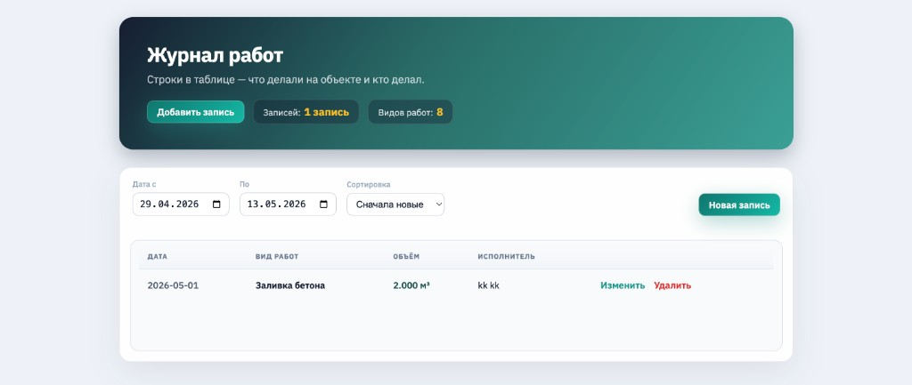

# Журнал работ (строительный объект)



## Что сделано по ТЗ

- **Список** — таблица: дата, вид работ, объём + ед. изм., ФИО исполнителя.
- **Фильтр и сортировка** по дате (поля «с / по», новые или старые сверху).
- **Создание** — форма, обязательные поля проверяются на фронте и на API.
- **Редактирование** и **удаление** записи.
- **Справочник видов работ** — отдельная таблица в PostgreSQL, при старте заполняется миграцией; в форме — выбор из списка.

## Дополнительные улучшения

Сверх обязательного минимума:

- **Swagger** — `/api/docs`, можно дернуть API из браузера без Postman; OpenAPI JSON на `/api/docs-json`.
- **Свой вид работ** — в форме пункт «Свой вид работ…», появляется поле с названием; при сохранении вид добавляется в справочник (`POST /api/work-types`), потом создаётся запись журнала.
- **Docker Compose** — Postgres + API + nginx с фронтом; проверяющему хватает одной команды, миграции и сид справочника накатываются при старте API.
- **Валидация на бэкенде** — DTO + `ValidationPipe` (обязательные поля, типы, длины).
- **Связь в БД** — `journal_entry.work_type_id` → `work_type.id`, `ON DELETE RESTRICT` (нельзя удалить вид, на который есть записи).
- **Индекс** по дате выполнения — быстрее фильтр и сортировка в журнале.
- **Корень API** — `GET /api` отдаёт список эндпоинтов и ссылку на Swagger.

## Бэкенд (DDD)

Код в `backend/src/contexts/`: **`catalog`** (виды работ), **`journal`** (записи), **`shared/persistence`** (TypeORM и репозитории). В каждом контексте — `domain` / `application` / `presentation`; домен без привязки к HTTP и ORM. Журнал перед сохранением проверяет, что вид работ есть в каталоге (+ FK в Postgres).

## Стек и зачем так

| Часть | Технология | Почему |
|-------|------------|--------|
| Фронт | React, TypeScript, Vite | По ТЗ — React с типами; Vite быстро собирает и поднимает dev без лишней настройки. |
| Бэкенд | NestJS | Удобно разложить API по модулям, DTO и валидация из коробки. |
| БД | PostgreSQL | Нормальные связи и ограничения (FK на вид работ). |
| ORM | TypeORM | Миграции и сущности, данные не в памяти и не в файле. |
| Запуск | Docker Compose | Одна команда: Postgres + API + фронт за nginx. |

Фронт ходит в бэкенд только через REST (`/api`). В Docker nginx отдаёт статику и проксирует API на один порт **8080**.

## Запуск (рекомендуется)

Нужны Docker и Docker Compose.

1. Клонировать репозиторий и перейти в папку проекта.
2. Выполнить:

```bash
docker compose up --build
```

3. Открыть в браузере: **http://localhost:8080**

При первом старте API сам накатывает миграции и заполняет справочник видов работ.

Остановка:

```bash
docker compose down
```

Удалить данные БД:

```bash
docker compose down -v
```

Файлы **`backend/.env`** и **`frontend/.env`** уже в репозитории (для быстрого старта тестового). В Compose хост БД для API — `postgres`; если запускать backend локально через `npm run`, в том же файле используется `localhost`.

Полезные адреса:

| Что | URL |
|-----|-----|
| Приложение | http://localhost:8080 |
| API | http://localhost:3000/api |
| Swagger | http://localhost:8080/api/docs |

## Запуск без полного Docker

Только база в контейнере, код локально:

```bash
docker compose up -d postgres
```

Терминал 1 — API:

```bash
cd backend
npm install
npm run migration:run
npm run start:dev
```

Терминал 2 — фронт:

```bash
cd frontend
npm install
npm run dev
```

UI обычно на **http://localhost:5173** (прокси на API в `frontend/vite.config.ts`).

## API

Префикс **`/api`**. Подробнее — в Swagger.

- `GET /api/work-types` — список видов работ
- `POST /api/work-types` — добавить вид (тело `{ "name": "…" }`)
- `GET /api/journal-entries?from=&to=&sortOrder=ASC|DESC` — журнал
- `POST /api/journal-entries` — новая запись
- `PATCH /api/journal-entries/:id` — изменить
- `DELETE /api/journal-entries/:id` — удалить

## Структура репозитория

- `frontend/` — React SPA
- `backend/` — NestJS, миграции TypeORM, `src/contexts/` (DDD)
- `docker-compose.yml` — postgres, api, web (nginx)
# test_task
